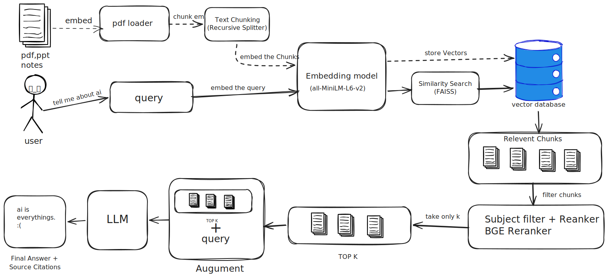

# 🎓 College Notes Assistant (RAG-Based)

Welcome to the **College Notes Assistant**, a Retrieval-Augmented Generation (RAG) powered search and QA assistant. This system enables students to query multiple academic notes across subjects (such as DBMS, Operating Systems, Computer Networks, and OOP) and receive accurate, source-aware answers.

---

## 🏗️ System Architecture

Below is the RAG pipeline architecture diagram showing document ingestion, processing, and vector search retrieval flow:



---

## 🚀 Key Features

* 📁 **Folder-Based Subject Classification:** Simply organize files into directories (e.g. `notes/DBMS/`, `notes/Operating Systems/`) and they will be automatically classified by subject.
* 📄 **Multi-Format Processing:** Supports text extraction from **PDFs**, **PowerPoint Slide Decks (PPTX)**, and **Word Documents (DOCX)**.
* ⚡ **High-Speed Parsing & Cache:** Text is extracted page-by-page (or slide-by-slide) and stored in a structured JSON database cache (`data/extracted/`) to skip slow re-parsing.
* 🔌 **FastAPI Backend:** Lightweight API endpoints for file uploads, scanning, document management, and statistics.

---

## 📂 Project Directory Structure

```text
EASY_STUDY/
├── backend/
│   ├── app/
│   │   ├── api/
│   │   │   └── endpoints.py         # API Router & Routes
│   │   ├── core/
│   │   │   └── config.py            # Path-based Global Configuration
│   │   ├── services/
│   │   │   └── document_service.py  # Ingestion & Recursive Scanning Logic
│   │   ├── utils/
│   │   │   ├── pdf_parser.py        # PDF Page Text Parser
│   │   │   ├── pptx_parser.py       # PPTX Slide Text Parser
│   │   │   └── docx_parser.py       # DOCX Paragraph/Table Parser
│   │   └── main.py                  # FastAPI Application Entrypoint
│   ├── requirements.txt             # Python Library Dependencies
│   └── run.py                       # Server Startup Script
├── notes/                           # Raw Files (Organized by Subject Folder)
│   ├── DBMS/                        # DBMS Notes
│   ├── Operating Systems/           # OS Notes
│   ├── Computer Networks/           # CN Notes
│   └── OOP/                         # OOP Notes
├── data/
│   └── extracted/                   # Structured Extracted JSON Cache
│       ├── DBMS/
│       ├── Operating Systems/
│       ├── Computer Networks/
│       └── OOP/
├── test_ingest.py                   # Ingestion Parser Testing Script
├── create_dummy_pdfs.py             # Script to Generate Sample Multi-Format Notes
├── plan.txt                         # Complete Project Roadmap
└── README.MD                        # Documentation (This File)
```

---

## 🛠️ Installation & Setup

Ensure you have Python 3.10+ installed.

### 1. Install Dependencies
```bash
pip install -r backend/requirements.txt
```

### 2. (Optional) Generate Dummy Notes
If you don't have notes files ready, generate sample PDFs, PPTXs, and DOCXs in subject folders:
```bash
python create_dummy_pdfs.py
```

### 3. Run Parser Ingestion Test
Scan the `notes/` directory recursively to extract and cache text page-by-page:
```bash
python test_ingest.py
```
This produces structured `.json` documents inside the `data/extracted/` folder.

### 4. Start the Backend API Server
```bash
python backend/run.py
```
The server will boot on `http://127.0.0.1:8000`. You can visit:
- **Interactive Swagger Docs:** http://127.0.0.1:8000/docs
- **Status Check:** http://127.0.0.1:8000/
- **Documents Status List:** http://127.0.0.1:8000/api/documents
